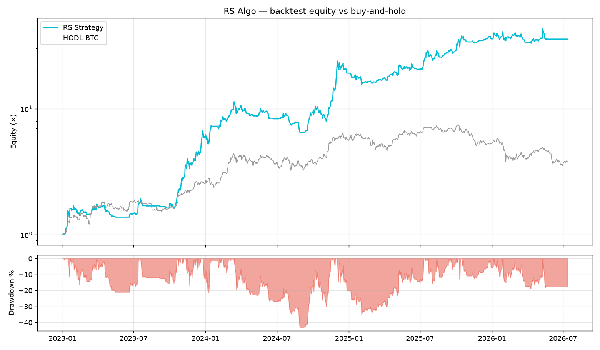

# Rs Algo System Showcase

A self-contained crypto trading system: it generates a **relative-strength (RS)
rotation** signal in-process on a daily schedule and executes the resulting
target allocation on your exchange accounts — all in one always-on service. A
read-only web dashboard shows the live equity curve and current positions.

> This is a simplified showcase edition. The strategy uses a plain RSI-based
> relative-strength rule over a fixed basket, with a spot-gold trend filter for
> bear markets.

## How it works

1. A daily scheduler runs the built-in signal generator (`src/signals/engine.py`)
   just after the Binance daily close.
2. The engine fetches prices, computes the strategy, and produces a **target
   allocation** (e.g. `BTC 80% | PAXG 20%`, or `CASH`).
3. The allocation is fed to the processor, which nets it across signal systems
   into one target portfolio.
4. The execution manager rebalances every enabled exchange account toward that
   target — **only when the allocation actually changed** vs. the last run.

The in-process generator is the only trade-triggering path — there is no inbound
webhook, so the endpoint that moves money is never exposed to the internet.

### The strategy

Over a fixed basket, each bar the engine (`src/signals/engine.py`):

1. Computes an **RSI signal** for every price and every pairwise price ratio —
   RSI(14) on a 7-day EMA, scored `+1` above 50 and `-1` below.
2. Ranks assets by their pairwise RS score, disqualifying any with a negative
   own-trend, no rolling alpha vs BTC, or below-median alpha.
3. Picks the top asset (and a co-leader on ties) at a fixed weight.
4. Applies a **bear-market filter**: when BTC's own trend is negative, it rotates
   to gold (PAXG) if the spot-gold trend (GLD proxy) is positive, else to cash.

### Backtest

`python -m src.signals.backtest` replays the exact same signal pipeline through a
daily equity walk-forward. Over **2023-01-01 → 2026-07-11** on the default
6-asset basket:



| Metric                | RS strategy | HODL BTC |
|-----------------------|------------:|---------:|
| Total return          |   +3466%    |   +285%  |
| CAGR                  |   +175.6%   |     —    |
| Sharpe (rf=0, √365)   |     2.01    |     —    |
| Max drawdown          |     43.0%   |    53.0% |
| Annualised volatility |     58.7%   |     —    |

> Reproduce with `python -m src.signals.backtest` (writes `backtest_out/`). These
> are gross figures on daily closes — no trading fees, slippage, or funding are
> modelled, so treat them as a strategy-logic demo, not a live-performance claim.

## Setup

```bash
pip install -r requirements.txt
cp .env.example .env          # fill in exchange API keys + tokens
cp config.example.yaml config.yaml
```

Edit `config.yaml` to set signal weights, enable/disable exchanges, and configure
the signal generator (basket, gold-filter symbol).

## Run

```bash
python -m src.main
```

The server starts on `http://0.0.0.0:8000`. Useful URLs:

- `http://localhost:8000/dashboard` — equity curve and positions
- `http://localhost:8000/health` — health check

Run just the signal generator (no server, prints the current allocation):

```bash
python -m src.signals.engine
```

## Allocation format

A signal is a **target allocation** (there is no per-order buy/sell — allocations
describe the desired portfolio). The in-process generator produces this shape, and
`/state` / `/test/rebalance` accept it:

```json
{
  "system": "system_1",
  "allocations": "BTC/USDT 80% | PAXG/USDT 20%"
}
```

| Field         | Type          | Required | Notes                                                                 |
|---------------|---------------|----------|-----------------------------------------------------------------------|
| `system`      | string        | yes      | Must match a key under `signals:` in `config.yaml`                    |
| `allocations` | string \| list | yes      | `"SYM PCT \| SYM PCT"` or `[{"symbol":"ETH/USDT","allocation":0.2}]`. Use `"CASH"` (or an empty list) to liquidate. |

Any portfolio fraction not allocated is held as cash (and, on Kraken with
`use_earn`, parked in Earn between rebalances).

## Multi-system weighting

When several signal systems run, each is weighted and their target allocations
are netted into one portfolio. Example:

```yaml
signals:
  system_1:
    weight: 0.6
  system_2:
    weight: 0.4
```

Shared assets owned by another system are protected (not sold) when only one
system rebalances; see `protected_symbols` / `protected_fraction` in
`src/signals/processor.py`.

## Dashboard & auth

`/dashboard` and the `/public/*` data feeds are gated by a single password when
`DASHBOARD_PASSWORD` and `SECRET_KEY` are set (signed HttpOnly session cookie,
per-IP brute-force lockout). When those are unset the dashboard serves open
(local dev). `/health` is always open.

| Method | Path                  | Auth            | Description                                  |
|--------|-----------------------|-----------------|----------------------------------------------|
| GET    | `/dashboard`          | session cookie  | Equity curve and positions                   |
| GET/POST | `/login`, `/logout` | —               | Password login / logout                      |
| GET    | `/public/equity`      | session/token   | Equity curve points                          |
| GET    | `/public/positions`   | session/token   | Current allocation                           |
| GET    | `/health`             | open            | Health check                                 |
| POST   | `/signal/run`         | admin token     | Run the generator now (executes if changed)  |
| GET/POST | `/state`            | admin token     | Inspect / overwrite in-memory signal state   |
| POST   | `/test/rebalance`     | admin token     | Dry-run rebalance (places no orders)         |
| POST   | `/report/now`         | admin token     | Send the weekly Telegram report now          |
| POST   | `/admin/equity/reset` | admin token     | Clear equity history to re-baseline the curve |

Admin token = `server.webhook_token` (kept as the config key name), passed via
`Authorization: Bearer <t>`, the `X-Token` header, or a `?token=` query parameter.

## Operating it (scripts)

```bash
# Inspect / drive the running app via its API
python scripts/control.py status      # health + equity + positions
python scripts/control.py run         # run the generator now (real rebalance if changed)
python scripts/control.py preview "BTC/USD 50% | ETH/USD 50%"   # dry-run

# Manage the production config (lives on the fly volume, edited over fly SSH)
python scripts/config.py pull         # download prod config -> ./config.yaml
python scripts/config.py push         # validate -> upload -> restart
python scripts/config.py diff
```

## Adding a new exchange

1. Add a class in `src/execution/exchanges/` that extends `BaseExchange` and sets `EXCHANGE_ID`.
2. Register it in `src/execution/manager.py` `_EXCHANGE_REGISTRY`.
3. Add its config block under `exchanges:` in `config.yaml`.

## Deployment (fly.io)

Runs as the fly app **signalautomation** (region `ams`, one always-on machine,
`state_data` volume). The live `config.yaml` lives on the volume (`CONFIG_PATH`)
and persists across deploys; secrets (API keys, tokens, `DASHBOARD_PASSWORD`,
`SECRET_KEY`) are fly secrets. Pushing to `main` auto-deploys via
`.github/workflows/fly-deploy.yml` (needs a `FLY_API_TOKEN` repo secret).

## Project layout

```
src/
  main.py              FastAPI app: dashboard, /signal/run, admin routes, lifespan
  config.py            config.yaml loader (signals, exchanges, signal_generator)
  models.py            shared pydantic models (WebhookSignal, TargetPortfolio, …)
  signals/
    engine.py          RS strategy — fetches data, computes the allocation
    backtest.py        replays the engine through a daily equity simulation
    scheduler.py       daily in-process generator (runs engine, executes on change)
    processor.py       nets signals across systems into a target portfolio
  execution/
    manager.py         fans rebalances out to all enabled exchange clients
    exchanges/         base + binance/bybit/kraken adapters
  monitoring/
    dashboard.html     read-only dashboard (equity + positions)
    auth.py            single-password session auth for the dashboard
    equity.py          periodic equity sampling -> curve
    notifier.py        Telegram alerts + weekly report
scripts/
  control.py           operate/verify the running app via its API
  config.py            manage the production config over fly SSH
```
